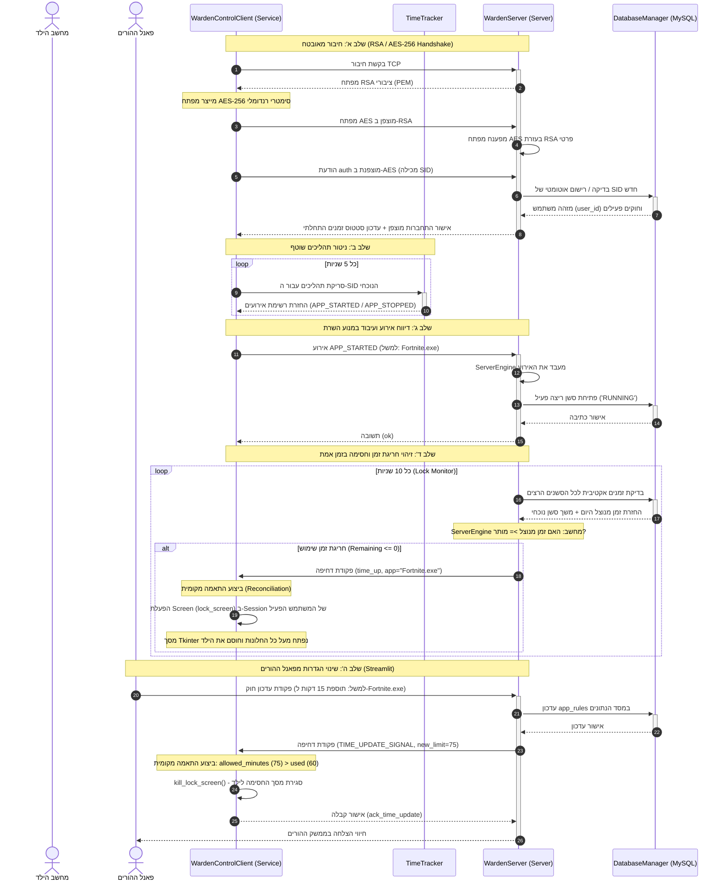

# סקירת מודולים ומחלקות - מערכת Warden Parental Control

במסמך זה מפורטת סקירה ארכיטקטונית מקיפה של כלל המודולים והמחלקות המרכיבים את מערכת **Warden**, כולל מודולים מיובאים (ספריות חיצוניות) והרכיבים שפותחו במסגרת הפרויקט (מחלקות, תכונות ופעולות עם טענות כניסה ויציאה), וכן תיאור קשרי הגומלין ביניהם.

---

## 1. מודולים ומחלקות מיובאים (ספריות חיצוניות)

להלן פירוט של הספריות והמודולים החיצוניים בהם המערכת משתמשת והתפקיד של כל אחד מהם:

| שם המודול המיובא | למה מיועד המודול בפרויקט (במשפט אחד) |
| :--- | :--- |
| **`socket`** | יצירת תקשורת רשת מבוססת TCP/IP להעברת הודעות ופקודות בזמן אמת בין הלקוח, השרת ולוח הבקרה. |
| **`threading`** | הרצת תהליכונים במקביל לביצוע משימות רקע אסינכרוניות כגון האזנה לחיבורים, סריקת תהליכים וניטור נעילות. |
| **`time`** | ניהול השהיות מתוזמנות (`sleep`) ומנגנוני המתנה בין סריקות או ניסיונות חיבור מחדש. |
| **`datetime`** | רישום חותמות זמן מדויקות (UTC ומקומי), חישוב משכי שימוש באפליקציות וניהול תאריכים להפרדת ימי פעילות. |
| **`struct`** | אריזה ופריקה בינארית של כותרות חבילות המידע ברשת לצורך ייצוג אורך הפלואוד בפורמט קבוע (Big-Endian). |
| **`json`** | קידוד ופענוח של הודעות המערכת ומבני הנתונים לפורמט טקסטואלי סטנדרטי (JSON) העובר על גבי הרשת. |
| **`os`** | עבודה מול מערכת ההפעלה, ניהול משתני סביבה, נתיבי קבצים ושינוי ספריית העבודה הנוכחית של השירות. |
| **`sys`** | הגדרת נתיבי חיפוש מודולים בפייתון (`sys.path`) וגישה לארגומנטים שהועברו בשורת הפקודה. |
| **`logging`** | רישום אירועים, פעולות מערכת ושגיאות בקובצי יומן (`.log`) נפרדים לכל רכיב לצורך ניפוי שגיאות ומעקב. |
| **`argparse`** | ניתוח פרמטרים המועברים בשורת הפקודה למסך החסימה (למשל, זיהוי שם האפליקציה שננעלה). |
| **`tkinter`** | בניית ממשק המשתמש הגרפי (GUI) של מסך חסימת האפליקציות המוצג בגודל מלא על גבי שולחן העבודה של הילד. |
| **`psutil`** | סריקת תהליכים פעילים במערכת ההפעלה, זיהוי פתיחה/סגירה של תוכנות, וביצוע הריגה ממוקדת של אפליקציות חסומות. |
| **`mysql.connector`** | חיבור לבסיס הנתונים Relational מסוג MySQL, הרצת שאילתות SQL וניהול טרנזקציות של נתוני משתמשים וסשנים. |
| **`bcrypt`** | ביצוע Hashing חד-כיווני מאובטח עם Salt לסיסמאות של ההורים לשם אימות מול לוח הבקרה. |
| **`cryptography`** | הצפנה אסימטרית (RSA-2048) להחלפת מפתחות מאובטחת, והצפנה סימטרית (AES-256 GCM) להצפנת תוכן ההודעות ברשת. |
| **`win32security`** | התממשקות עם מנגנוני האבטחה של Windows לשליפת ה-SID של המשתמשים וקריאת טוקני אבטחה של תהליכים. |
| **`win32api` / `win32con`** | גישה ישירה לקבועי מערכת הפעלה ופונקציות מערכת (כמו פתיחת תהליכים, קבלת מזהים וסגירת Handles). |
| **`win32process`** | יצירה וניהול של תהליכים במערכת ההפעלה Windows, כולל הרצת תהליך כמשתמש אחר מתוך שירות מערכת. |
| **`win32ts`** | שאילתות מול שירותי Terminal Services לצורך שליפת טוקן המשתמש הפיזי המחובר כעת לקונסול (Session ID). |
| **`win32profile`** | יצירת בלוק סביבה (Environment Block) מותאם למשתמש לצורך הרצת מסך הנעילה תחת פרופיל המשתמש שלו. |
| **`win32serviceutil` / `win32service`** | רישום, הגדרה וניהול של רכיב הלקוח כ-Windows Service הרץ ברקע ברמת מערכת ההפעלה. |
| **`win32event`** | סנכרון והמתנה לאירועי מערכת הפעלה (כמו פקודת עצירת השירות של Windows). |
| **`streamlit`** | פיתוח ממשק האינטרנט האינטראקטיבי והמעוצב עבור לוח הבקרה של ההורים להצגת סטטיסטיקות ושינוי חוקים בזמן אמת. |

---

## 2. מחלקות שפותחו בפרויקט

רכיבי המערכת מחולקים ל-4 מכלולים מרכזיים: `warden_core` (ליבה משותפת), `warden_server` (שרת), `warden_client` (לקוח וניטור) ו-`admin_panel` (פאנל הניהול של ההורים). להלן פירוט מקיף של כלל המחלקות שפותחו.

---

### מכלול 1: Core (רכיבי ליבה משותפים)

#### א. המחלקה `CryptoManager` (בקובץ `crypto.py`)
מחלקה סטטית המרכזת את כלל שירותי האבטחה, החלפת המפתחות המוצפנת והצפנת המידע העובר ברשת.

*   **תכונות המחלקה:**
    *   אין תכונות מופע (כל הפונקציות מוגדרות כ-`@staticmethod`).
*   **פעולות במחלקה:**

| שם הפעולה | טענת כניסה (פרמטרים) | טענת יציאה (מה מבצעת ומחזירה) |
| :--- | :--- | :--- |
| **`generate_rsa_keypair`** | אין | מייצרת זוג מפתחות RSA חדש (באורך 2048 ביט עם מעריך ציבורי 65537). מחזירה את אובייקט המפתח הפרטי (`private_key`). |
| **`get_public_key_bytes`** | `private_key` (אובייקט מפתח פרטי) | מייצאת ומחזירה את המפתח הציבורי בפורמט בתים (Bytes) מקודד ב-PEM (SubjectPublicKeyInfo). |
| **`load_public_key`** | `pub_key_bytes` (בתים בפורמט PEM) | טוענת את המפתח הציבורי הבינארי ומחזירה אובייקט מפתח ציבורי RSA פעיל לביצוע הצפנה. |
| **`encrypt_rsa`** | `public_key` (אובייקט מפתח), `data` (בתים) | מצפינה את המידע בעזרת מפתח ציבורי של RSA וריפוד OAEP עם SHA-256. מחזירה את המידע המוצפן (בתים). |
| **`decrypt_rsa`** | `private_key` (אובייקט מפתח), `ciphertext` (בתים) | מפענחת את המידע המוצפן בעזרת המפתח הפרטי וריפוד OAEP. מחזירה את המידע המפוענח (בתים). |
| **`generate_aes_key`** | אין | מייצרת ומחזירה מפתח סימטרי רנדומלי מסוג AES באורך 256 ביט (32 בתים). |
| **`encrypt_aes`** | `key` (בתים), `data` (בתים) | מצפינה את המידע בפורמט AES-GCM סימטרי. מייצרת Nonce באורך 12 בתים ומחזירה שרשור של ה-Nonce והמידע המוצפן. |
| **`decrypt_aes`** | `key` (בתים), `encrypted_data` (בתים) | מפענחת מידע שהוצפן ב-AES-GCM. מפרידה את ה-Nonce (12 בתים ראשונים) ומחזירה את המידע המפוענח המקורי. |

---

#### ב. המחלקה `DatabaseManager` (בקובץ `database.py`)
המחלקה האחראית על ניהול מסד הנתונים של המערכת (MySQL), הקמת הטבלאות, שאילתות, הרשאות, מעקב סשנים פעילים ורישום לוגים.

*   **תכונות המחלקה:**
    *   `host` (מחרוזת): כתובת שרת ה-MySQL (ברירת מחדל `"127.0.0.1"`).
    *   `user` (מחרוזת): שם המשתמש להתחברות למסד הנתונים (`"root"`).
    *   `password` (מחרוזת): הסיסמה להתחברות למסד הנתונים (`"Itzik@2007"`).
    *   `db_name` (מחרוזת): שם בסיס הנתונים של הפרויקט (`"warden_db"`).
    *   `db` (אובייקט חיבור): חיבור הסוקט הפעיל מול שרת ה-MySQL.
    *   `cursor` (אובייקט סמן): סמן ברירת המחדל להרצת שאילתות SQL.
*   **פעולות במחלקה:**

| שם הפעולה | טענת כניסה (פרמטרים) | טענת יציאה (מה מבצעת ומחזירה) |
| :--- | :--- | :--- |
| **`__init__`** | אין | מגדירה את מאפייני החיבור, יוצרת את ה-DB במידת הצורך, מתחברת ומאתחלת את הטבלאות. |
| **`_initialize_database`** | אין | מתחברת זמנית לשרת ללא מסד נתונים, בודקת אם `warden_db` קיים, ואם לא - יוצרת אותו. |
| **`_connect`** | אין | מקימה חיבור קבוע עם `autocommit=True` ומגדירה סמן מבוסטר (buffered) לעבודה שוטפת. |
| **`_initialize_tables`** | אין | מקימה את כל 6 הטבלאות המרכזיות ויוצרת מפתחות זרים, אינדקסים ייחודיים ועמודות גיבוי במידת הצורך. |
| **`add_family`** | `parent_email` (מחרוזת) | מכניסה רשומה חדשה לטבלת המשפחות ומחזירה את מזהה המשפחה שנוצר (`family_id`). |
| **`add_user`** | `family_id` (שלם), `sid` (מחרוזת), `name` (מחרוזת), `user_type` (ENUM), `status` (ENUM) | מכניסה משתמש חדש (ילד/הורה) למערכת ומחזירה את מזהה המשתמש החדש שנוצר (`user_id`). |
| **`add_device`** | `family_id` (שלם), `device_name` (מחרוזת) | מוסיפה רשומת מכשיר חדש המשויך למשפחה לטבלת `devices`. |
| **`add_app_rule`** | `user_id` (שלם), `app_name` (מחרוזת), `allowed_minutes` (שלם) | מוסיפה חוק שימוש חדש המגדיר מגבלת דקות לאפליקציה עבור משתמש מסוים. |
| **`log_usage`** | `user_id` (שלם), `app_name` (מחרוזת), `duration` (שלם, דקות) | רושמת אירוע שימוש היסטורי בטבלת `usage_logs` עם חותמת הזמן הנוכחית (`NOW()`). |
| **`start_app_session`** | `user_id` (שלם), `app_name` (מחרוזת), `start_time` (datetime) | יוצרת סשן ריצה פעיל בטבלת `app_sessions` עם סטטוס `'RUNNING'`. |
| **`get_running_session`** | `user_id` (שלם), `app_name` (מחרוזת) | מחפשת סשן פתוח עבור האפליקציה המבוקשת. מחזירה מילון עם מזהה הסשן וזמן ההתחלה שלו, או `None` אם אין סשן ריצה פעיל. |
| **`get_app_rule`** | `user_id` (שלם), `app_name` (מחרוזת) | מחזירה מילון המכיל את כמות הדקות המותרות לשימוש באפליקציה, או `None` אם אין הגבלה מוגדרת. |
| **`set_admin_password`** | `email` (מחרוזת), `password` (מחרוזת) | מצפינה את סיסמת ההורה ב-`bcrypt` ומעדכנת אותה ברשומת המשפחה המתאימה בבסיס הנתונים. |
| **`verify_admin`** | `email` (מחרוזת), `password` (מחרוזת) | מאמתת סיסמת הורה. במידה וזו כניסה ראשונית של הורה רשום ללא סיסמה, היא מגדירה אותה אוטומטית ומאשרת כניסה. מחזירה `True` או `False`. |
| **`update_app_rule`** | `user_id` (שלם), `app_name` (מחרוזת), `allowed_minutes` (שלם) | מעדכנת את כמות הדקות המותרת באפליקציה. משתמשת ב-`ON DUPLICATE KEY UPDATE` ליצירה או עדכון חוק קיים. |
| **`can_user_run_app`** | `sid` (מחרוזת), `app_name` (מחרוזת) | בודקת האם המשתמש חרג ממכסת הדקות המותרת להיום באפליקציה (מסכמת את כל הלוגים של היום). מחזירה `True` או `False`. |
| **`remaining_time`** | `sid` (מחרוזת), `app_name` (מחרוזת) | מחשבת ומחזירה את מספר הדקות שנותרו למשתמש להרצת האפליקציה להיום (מכסה פחות שימוש בפועל). |
| **`get_known_apps`** | `user_id` (שלם) | מחזירה רשימה של כלל האפליקציות שהמשתמש אי פעם הריץ (מאיחוד סשנים ויומני שימוש). |
| **`auto_register_sid`** | `sid` (מחרוזת), `family_id` (שלם, אופציונלי) | רושמת אוטומטית משתמש ילד חדש עם שם זמני המבוסס על סוף ה-SID שלו במידה והוא מתחבר לראשונה. |
| **`ensure_connection`** | אין | מבצעת בדיקת חיבור (`ping`) מול מסד הנתונים ומקימה חיבור מחדש במידה והוא התנתק או התיישן. |
| **`email_exists`** | `email` (מחרוזת) | בודקת האם כתובת האימייל של ההורה כבר קיימת בטבלת `families`. מחזירה `True` אם היא קיימת, או `False` אחרת (ערך בוליאני). |
| **`register_parent`** | `email` (מחרוזת), `password` (מחרוזת) | רושמת הורה חדש במערכת על ידי הצפנת סיסמתו ב-`bcrypt` והכנסתה לטבלת `families`. מחזירה את מזהה המשפחה שנוצר (`family_id`). זורקת `ValueError` אם המייל כבר קיים במערכת. |
| **`update_child_name`** | `user_id` (שלם), `new_name` (מחרוזת) | מעדכנת את השם של משתמש הילד ל-`new_name` ומעבירה את סטטוס המשתמש ל-`'ACTIVE'`. שומרת את השינויים ומחזירה `None`. |
| **`get_pending_devices`** | אין | שולפת את כל המשתמשים שהם מסוג ילד (`type='child'`) ושסטטוס הרישום שלהם הוא זמני/ממתין (`status='PENDING'`). מחזירה רשימת מילונים עם `id`, `sid`, ו-`name`. |
| **`get_used_time_today`** | `user_id` (שלם), `app_name` (מחרוזת) | מחשבת ומסכמת את סך כל דקות השימוש שהמשתמש צבר היום באפליקציה המבוקשת מתוך טבלת `usage_logs`. מחזירה את כמות הדקות כערך עשרוני/שלם (או `0` אם אין רשומות). |
| **`reset_database`** | אין | מוחקת לחלוטין את מסד הנתונים `warden_db` (אם קיים), יוצרת אותו מחדש, מתחברת ומקימה מחדש את כל הטבלאות כשהן ריקות. מחזירה `None`. |

---

#### ג. המחלקה `ServerEngine` (בקובץ `engine.py`)
המחלקה המיישמת את מנוע עיבוד האירועים המרכזי של המערכת. אחראית על ניתוח פתיחה וסגירה של תוכנות, סגירת סשנים וחישוב זמני שימוש.

*   **תכונות המחלקה:**
    *   `db` (אובייקט `DatabaseManager`): הפניה למנהל בסיס הנתונים של השרת.
    *   `logger` (אובייקט לוגר): מופע לוגר לתיעוד פעילות המנוע.
*   **פעולות במחלקה:**

| שם הפעולה | טענת כניסה (פרמטרים) | טענת יציאה (מה מבצעת ומחזירה) |
| :--- | :--- | :--- |
| **`__init__`** | `db` (מופע של `DatabaseManager`) | מאתחלת את המנוע ומגדירה את קובץ הלוג של המנוע (`engine.log`). |
| **`process_event`** | `event` (מילון אירוע הכולל: `event_name`, `sid`, `metadata`, `timestamp`) | מנתחת את שם האירוע ומנתבת אותו לפעולת הטיפול המתאימה (`handle_app_start` או `handle_app_stop`). |
| **`handle_app_start`** | `sid` (מחרוזת), `app` (מחרוזת), `timestamp` (datetime) | שולפת מזהה משתמש לפי SID. מוודאת שאין סשן פעיל כפול, ומריצה `db.start_app_session` לרישום תחילת שימוש. |
| **`handle_app_stop`** | `sid` (מחרוזת), `app` (מחרוזת), `timestamp` (datetime) | שולפת מזהה משתמש. מאתרת את הסשן הפעיל, מחשבת את משך השימוש בדקות (סיום פחות התחלה), מעדכנת את הסשן ל-`'CLOSED'` ורושמת יומן שימוש חדש. |
| **`can_user_run_app`** | `sid` (מחרוזת), `app` (מחרוזת) | מחשבת זמן שימוש ומחזירה `True` אם נותר למשתמש זמן באפליקציה, או `False` אם זמנו נגמר. |
| **`cleanup_stale_sessions`** | `timeout_minutes` (שלם, ברירת מחדל 10) | מאתרת סשנים הרצים ברציפות מעבר לזמן המותר ללא עדכון (למשל, בעקבות קריסת מחשב ללא אירוע סגירה) וסוגרת אותם. |

---

#### ד. המחלקה `Protocol` (בקובץ `protocol.py`)
מחלקה סטטית המיישמת את פרוטוקול הרשת האפליקטיבי מעל TCP. מבטיחה שליחה וקבלה מדויקת של חבילות מידע מוצפנות וסיראליזציה של ההודעות.

*   **תכונות המחלקה:**
    *   אין תכונות מופע (כל הפעולות הן `@staticmethod`).
*   **פעולות במחלקה:**

| שם הפעולה | טענת כניסה (פרמטרים) | טענת יציאה (מה מבצעת ומחזירה) |
| :--- | :--- | :--- |
| **`recv_exact`** | `sock` (אובייקט סוקט), `num_bytes` (שלם) | קוראת בלולאה חוסמת מהסוקט עד לקבלת כמות הבתים המבוקשת בדיוק. מחזירה את הבתים שנקראו או `None` במקרה של ניתוק. |
| **`recv_packet`** | `sock` (אובייקט סוקט) | קוראת כותרת של 8 בתים, מפענחת את מזהה הפרוטוקול `'WRDN'` ואת אורך המידע. קוראת בדיוק את מספר הבתים של גוף ההודעה ומחזירה אותו. |
| **`send_packet`** | `sock` (סוקט), `payload_bytes` (בתים) | אורזת כותרת בת 8 בתים (ה-Magic Header ואורך גוף ההודעה כשלם בינארי ב-Big-Endian) ושולחת אותה יחד עם המידע לסוקט. |
| **`serialize_message`** | `cmd` (מחרוזת), `data` (מילון/מידע) | אורזת את הפקודה והנתונים בממבנה מילון מוסכם, הופכת אותו למחרוזת JSON ומקודדת אותו לבתים ב-UTF-8. |
| **`deserialize_message`** | `payload_bytes` (בתים) | מפענחת בתים כמחרוזת UTF-8, מפרשת אותה כאובייקט JSON ומחזירה טאפל המכיל את שם הפקודה והמידע (`cmd, data`). |

---

#### ה. המחלקה `my_logger` (בקובץ `setup_logger.py`)
מחלקה ליצירה וניהול קובצי לוג מוגדרים מראש עבור רכיבי המערכת השונים.

*   **תכונות המחלקה:**
    *   `name` (מחרוזת): שם הלוגר לצורכי זיהוי ברשומות.
    *   `log_file` (מחרוזת): נתיב מלא לשמירת קובץ ה-Log.
    *   `level` (שלם): רמת החומרה המינימלית לרישום (ברירת מחדל `logging.INFO`).
*   **פעולות במחלקה:**

| שם הפעולה | טענת כניסה (פרמטרים) | טענת יציאה (מה מבצעת ומחזירה) |
| :--- | :--- | :--- |
| **`__init__`** | `name` (מחרוזת), `log_file` (מחרוזת), `level` (שלם), `log_directory` (מחרוזת) | מייצרת את תיקיית היעד במידה ואינה קיימת ומגדירה את משתני המופע. |
| **`setup_logger`** | אין | מקימה ומגדירה אובייקט `logging.Logger` עם `FileHandler` ופורמט רישום קבוע. מונעת כפל הדפסות ומחזירה את הלוגר. |

---

#### ו. המחלקה `SID` (בקובץ `sid_helper.py`)
המחלקה האחראית על זיהוי ה-SID (Security Identifier) של המשתמש הפעיל כרגע בקונסול הפיזי של מערכת ההפעלה Windows.

*   **תכונות המחלקה:**
    *   `logger` (אובייקט לוגר): לוגר תהליך זיהוי ה-SID.
    *   `sidstr` (מחרוזת/None): שומרת את ה-SID האחרון שזוהה.
*   **פעולות במחלקה:**

| שם הפעולה | טענת כניסה (פרמטרים) | טענת יציאה (מה מבצעת ומחזירה) |
| :--- | :--- | :--- |
| **`__init__`** | אין | מאתחלת את הלוגר המיועד ומגדירה את ה-`sidstr` כ-`None`. |
| **`GetSID`** | אין | פונה ל-Windows APIs. שולפת את מזהה הסשן הפיזי האקטיבי, מאתרת את שם המשתמש והדומיין שלו, ממירה ל-SID ומחזירה אותו כמחרוזת. במקרה של כישלון או הרצת שירות ללא סשן, מפעילה מנגנון גיבוי הקורא את הבעלים של תיקיית הפרויקט ומחזירה את ה-SID שלו. |

---

### מכלול 2: Server (רכיבי שרת התקשורת)

#### ז. המחלקה `WardenServer` (בקובץ `warden_server/main.py`)
המחלקה המנהלת את שרת התקשורת הראשי (TCP). מאזינה לחיבורים, מאמתת לקוחות, מנתבת פקודות ומנטרת זמני שימוש לחסימה מיידית.

*   **תכונות המחלקה:**
    *   `host` (מחרוזת): כתובת ההאזנה של הסוקט.
    *   `port` (שלם): פורט ההאזנה של הסוקט (`8000`).
    *   `db` (אובייקט `DatabaseManager`): מנהל מסד הנתונים של השרת.
    *   `engine` (אובייקט `ServerEngine`): מנוע הליבה לניהול אירועי אפליקציות.
    *   `logger` (אובייקט לוגר): לוגר השרת הראשי.
    *   `clients_by_sid` (מילון): מיפוי משתמשים מחוברים: `sid -> {sock, aes_key, write_lock}`.
    *   `clients_lock` (Lock): מנעול לסנכרון גישה למילון הלקוחות המחוברים.
    *   `db_lock` (RLock): מנעול סנכרון רב-כניסתי (Recursive) לפעולות מול בסיס הנתונים.
    *   `locked_sessions` (Set): קבוצת מזהי סשנים שנחסמו כרגע עקב חריגת זמן.
    *   `locked_sessions_lock` (Lock): מנעול לסינכרון הרשימה החסומה.
    *   `private_key` (RSA Private Key): מפתח RSA פרטי של השרת לצורך אימות.
    *   `public_key_bytes` (בתים): מפתח RSA ציבורי בפורמט בתים להפצה ראשונית ברשת.
    *   `is_running` (בוליאני): מציין האם השרת פעיל כרגע.
*   **פעולות במחלקה:**

| שם הפעולה | טענת כניסה (פרמטרים) | טענת יציאה (מה מבצעת ומחזירה) |
| :--- | :--- | :--- |
| **`__init__`** | `host` (מחרוזת), `port` (שלם) | מאתחלת את מנעולי הסנכרון, מקימה את המנוע, בסיס הנתונים ומייצרת את זוג מפתחות ה-RSA. |
| **`start`** | אין | מנקה סשנים ישנים, קושרת את הסוקט TCP, מתחילה להאזין, מפעילה את תהליכוני הניטור הראשיים ומקבלת לקוחות בלולאה. |
| **`stop`** | אין | מעדכנת את דגל הריצה ל-`False` וסוגרת את סוקט השרת. |
| **`_cleanup_stale_sessions`** | אין | מעדכנת את כל הסשנים שהיו פתוחים בריצה הקודמת לסטטוס `'CLOSED'` ומגדירה להם זמן סיום נוכחי. |
| **`_lock_monitor_loop`** | אין | תהליכון רקע המבצע סריקה תקופתית (כל 10 שניות) של אפליקציות חורגות אצל המשתמשים הפעילים. |
| **`_status_printer_loop`** | אין | תהליכון רקע המדפיס באופן מחזורי (כל 10 שניות) למסך השרת את מצב המשתמשים והזמנים שלהם. |
| **`_check_active_sessions_for_time_expired`** | אין | שולפת את כל הסשנים הפעילים, מחשבת זמן שנותר, ובמידה ונגמר - שולחת ללקוח פקודת נעילה ומעדכנת את `locked_sessions`. |
| **`_push_command`** | `sid` (מחרוזת), `action` (מחרוזת), `app` (מחרוזת, אופציונלי) | מאתרת לקוח מחובר לפי SID, מצפינה את הפקודה ב-AES ושולחת אותה באופן מסונכרן (thread-safe) דרך הסוקט. מחזירה `True` על הצלחה. |
| **`handle_client`** | `client_sock` (סוקט), `addr` (כתובת) | מבצעת לחיצת יד מאובטחת (שליחת מפתח RSA, קבלת מפתח AES מוצפן ופענוחו) ומריצה לולאת קבלת פקודות, עיבודן ושליחת תשובות מוצפנות. |
| **`process_command`** | `cmd` (מחרוזת), `data` (מילון) | מנתחת ומעבדת פקודות: רישום, דיווח אירועים, בדיקות זמנים, עדכון חוקים, הוספת זמן, נעילה ושחרור מרחוק. מחזירה מילון תשובה ללקוח. |

---

### מכלול 3: Client (רכיבי לקוח וניטור במחשב הילד)

#### ח. המחלקה `WardenNetClient` (בקובץ `warden_client/net_client.py`)
רכיב הלקוח האחראי על ניהול ערוץ התקשורת המוצפן מול השרת לביצוע שליחת פקודות ודיווחים באופן יזום.

*   **תכונות המחלקה:**
    *   `host` (מחרוזת): כתובת השרת.
    *   `port` (שלם): פורט השרת (`8000`).
    *   `sock` (אובייקט סוקט): סוקט התקשורת הפעיל.
    *   `aes_key` (בתים): מפתח ה-AES הסימטרי שנוצר עבור סשן זה.
    *   `logger` (אובייקט לוגר): לוגר הרשת של הלקוח.
*   **פעולות במחלקה:**

| שם הפעולה | טענת כניסה (פרמטרים) | טענת יציאה (מה מבצעת ומחזירה) |
| :--- | :--- | :--- |
| **`__init__`** | `host` (מחרוזת), `port` (שלם) | מאתחלת את פרמטרי השרת ומסמנת את הסוקט ומפתח ה-AES כ-`None`. |
| **`connect`** | אין | פותחת חיבור TCP, מקבלת מפתח RSA ציבורי של השרת, מייצרת מפתח AES, מצפינה אותו ושולחת אותו לשרת. מחזירה `True` על הצלחה. |
| **`send_command`** | `cmd` (מחרוזת), `data` (מילון) | מתחברת במידת הצורך. אורזת את המידע, מצפינה אותו ב-AES, שולחת לשרת, ממתינה לתגובה, מפענחת אותה ומחזירה את תוכן התגובה. |
| **`close`** | אין | סוגרת את הסוקט ומאפסת את מפתח ה-AES והסוקט ל-`None`. |

---

#### ט. המחלקה `TimeTracker` (בקובץ `warden_client/time_tracker.py`)
המחלקה האחראית על מעקב וזיהוי תהליכים פעילים השייכים למשתמש הספציפי במערכת ההפעלה והפקת אירועי פתיחה וסגירה.

*   **תכונות המחלקה:**
    *   `logger` (אובייקט לוגר): לוגר מעקב התהליכים.
    *   `active_processes` (מילון): מילון הממפה מזהה תהליך לשם האפליקציה שלו (`pid -> app_name`) שהיו פעילים בסבב הסריקה הקודם.
*   **פעולות במחלקה:**

| שם הפעולה | טענת כניסה (פרמטרים) | טענת יציאה (מה מבצעת ומחזירה) |
| :--- | :--- | :--- |
| **`__init__`** | אין | מאתחלת את הלוגר ומסמנת את מילון התהליכים כריק. |
| **`get_sid_of_process`** | `pid` (שלם) | פותחת את טוקן התהליך מול ה-Windows API ושולפת את ה-SID שלו. במידת הצורך (חוסר הרשאות) מבצעת fallback מול שם המשתמש. מחזירה מחרוזת SID או `None`. |
| **`scan_processes`** | `target_sid` (מחרוזת) | סורקת את כל התהליכים הפעילים במערכת השייכים ל-`target_sid`. מחשבת שינויים ומחזירה רשימת מילוני אירועים מסוג `APP_STARTED` ו-`APP_STOPPED`. |

---

#### י. המחלקה `WardenControlClient` (בקובץ `warden_client/service.py`)
הלקוח הראשי המקשר בין סריקת התהליכים, תקשורת הרשת, ומסכי הנעילה הפיזיים. מתפקד כליבת הלוגיקה של תחנת הקצה.

*   **תכונות המחלקה:**
    *   `host` (מחרוזת): כתובת השרת.
    *   `port` (שלם): פורט השרת.
    *   `sock` (אובייקט סוקט): חיבור הסוקט הפעיל מול השרת.
    *   `listener_thread` (Thread): תהליכון להאזנה לפקודות שנדחפות מהשרת.
    *   `event_thread` (Thread): תהליכון לסריקה ודיווח מחזורי של תהליכים.
    *   `stop_event` (Event): אירוע לעצירה מסודרת של התהליכונים.
    *   `sid_helper` (מופע `SID`): רכיב לשליפת ה-SID הפעיל.
    *   `lock_screen_process` (אובייקט תהליך): אובייקט עטיפה לתהליך מסך הנעילה הנוכחי.
    *   `locked_app_name` (מחרוזת/None): שם האפליקציה שנחסמה כרגע.
    *   `aes_key` (בתים): מפתח ה-AES הסימטרי הפעיל.
    *   `sid` (מחרוזת): ה-SID הנוכחי המזוהה אצל הלקוח.
    *   `tracker` (מופע `TimeTracker`): סורק התהליכים.
    *   `max_retries` (שלם): כמות נסיונות אימות מקסימלית (`5`).
    *   `retry_count` (שלם): מספר נסיונות האימות שבוצעו בריצה זו.
    *   `app_states` (מילון): מילון מעקב זמנים מקומי (עבור לוגיקת ההתאמה המקומית - Reconciliation).
    *   `logger` (אובייקט לוגר): לוגר השירות הראשי (`service.log`).
*   **פעולות במחלקה:**

| שם הפעולה | טענת כניסה (פרמטרים) | טענת יציאה (מה מבצעת ומחזירה) |
| :--- | :--- | :--- |
| **`__init__`** | `host` (מחרוזת), `port` (שלם) | מגדירה את הלוגר הייחודי המקומי ומאתחלת את מאפייני הרכיבים. |
| **`get_sid`** | אין | פונה ל-`sid_helper` ומחזירה את ה-SID הפעיל כרגע. זורקת שגיאה במידה ואינו נמצא. |
| **`connect`** | אין | סוגרת חיבור קודם, מקימה סוקט חדש ומתחברת לשרת. מחזירה `True` על הצלחה. |
| **`authenticate`** | אין | מנהלת את לחיצת היד לאבטחת החיבור (RSA/AES) מול השרת ושולחת הודעת רישום של ה-SID המקומי. |
| **`start`** | אין | מפעילה את מנגנון הריצה של הלקוח. מנסה להתחבר, לאמת, להתחיל את תהליכוני ההאזנה והסריקה, ומנהלת השהיות חיבור מחדש במקרה של שגיאות רשת. |
| **`_event_loop`** | אין | לולאת סריקת תהליכים (כל 5 שניות). בודקת החלפת משתמשים (SID), מדווחת על אירועים לשרת ומעדכנת זמני שימוש מקומיים לצורך סנכרון מדויק. |
| **`_listen_loop`** | אין | לולאה הממתינה לקבלת פקודות דחיפה מהשרת, מפענחת אותן ומנתבת לטיפול. |
| **`_handle_command`** | `cmd` (מחרוזת), `data` (מילון) | מטפלת בפקודות: חסימה (מפעילה את מסך הנעילה), שחרור (סוגרת את מסך הנעילה), סנכרון ומעקף, והשבתת השירות. מבצעת לוגיקת התאמה מקומית (`Reconciliation`). |
| **`launch_lock_screen`** | אין | מבצעת עקיפה של Session 0 (הרצת תהליך משירות מערכת) באמצעות שכפול טוקן ה-SYSTEM, שינוי ה-Session ID והזרקתו לתוך הסשן הפעיל באמצעות `CreateProcessAsUser` כדי להציג את מסך החסימה לילד. |
| **`kill_lock_screen`** | אין | סורקת והורגת בכוח את כל תהליכי מסך הנעילה (`lock_screen.exe` או סקריפט הריצה שלו) הרצים כעת במחשב כדי לאפשר חזרה לפעילות רגילה. |
| **`send_message`** | `cmd` (מחרוזת), `data` (מילון) | מצפינה ושולחת הודעה יזומה לשרת דרך ערוץ ה-TCP הפעיל. |

---

#### יא. המחלקה `MyParentalControlService` (בקובץ `warden_client/service.py`)
מחלקת השירות של Windows המאפשרת להריץ את הלקוח ברקע ברמת מערכת ההפעלה, ללא תלות בכניסת משתמש.

*   **תכונות המחלקה:**
    *   `hWaitStop` (אובייקט Win32 Event): אירוע המערכת המשמש לסימון עצירת השירות.
    *   `client` (מופע `WardenControlClient`): מופע הלקוח האמיתי.
*   **פעולות במחלקה:**

| שם הפעולה | טענת כניסה (פרמטרים) | טענת יציאה (מה מבצעת ומחזירה) |
| :--- | :--- | :--- |
| **`__init__`** | `args` (רשימה) | מאתחלת את בנאי ה-`ServiceFramework` של Windows, מקימה את אירוע העצירה ואת מופע הלקוח. |
| **`SvcStop`** | אין | מדווחת למערכת על מעבר למצב עצירה, מפע指示ה את אירוע העצירה ומסמנת ללקוח לסיים את עבודתו. |
| **`SvcDoRun`** | אין | נקראת על ידי מערכת ההפעלה עם הפעלת השירות. מריצה את הלקוח בלולאה חוסמת עד לקבלת פקודת עצירה. |

---

#### יב. המחלקה `Screen` (בקובץ `warden_client/lock_manager/lock_screen.py`)
המחלקה המייצרת את חלון ממשק המשתמש הגרפי החוסם (GUI) המוצג במחשב הילד כאשר זמנו באפליקציה תם.

*   **תכונות המחלקה:**
    *   `root` (אובייקט Tkinter): החלון הראשי המנוהל של ממשק המשתמש.
    *   `target_app` (מחרוזת/None): שם האפליקציה החסומה הנוכחית (`Fortnite.exe`).
    *   `usage_text` (אובייקט טקסט Tkinter): חלון הלוג המקומי המוצג בתחתית מסך הנעילה.
*   **פעולות במחלקה:**

| שם הפעולה | טענת כניסה (פרמטרים) | טענת יציאה (מה מבצעת ומחזירה) |
| :--- | :--- | :--- |
| **`__init__`** | `target_app` (מחרוזת, אופציונלי) | מאתחלת את מאפייני האפליקציה הנעולה. |
| **`create_lock_screen`** | אין | יוצרת חלון Tkinter מסך מלא, מסירה כפתורי בקרה, מגדירה אותו כעליון ביותר (`-topmost`) ומעצבת ממשק כהה מתקדם עם כפתור מעקף וסגירה. מפעילה את ה-`mainloop` ומנגנון שמירת פוקוס מחזורי. |
| **`_parent_override`** | אין | מורידה זמנית את עליונות המסך, מציגה תיבת דיאלוג להזנת קוד PIN, בודקת מול הקובץ המקומי. במידה והקוד נכון, סוגרת את מסך החסימה ומאפשרת פעילות. במידה ולא, מציגה אזהרת "PIN שגוי" מונפשת ומחזירה את עליונות המסך. |
| **`_close_target_app`** | אין | מאתרת והורגת בכוח (באמצעות `psutil` או `taskkill`) את כל התהליכים של האפליקציה החסומה, ומשמידה את חלון החסימה. |

---

#### יג. המחלקה `AppLocker` (בקובץ `warden_client/lock_manager/lock_app.py`)
המחלקה האחראית על שמירה, טעינה וניהול שוטף של רשימת האפליקציות החסומות מקומית אצל הילד, באמצעות קובץ הגדרות JSON קבוע.

*   **תכונות המחלקה:**
    *   `config_file` (נתיב קובץ / Path): נתיב מלא לקובץ ה-JSON שבו נשמרת רשימת התוכנות החסומות (בברירת מחדל בנתיב `AppData/Roaming/Warden/locked_apps.json`).
    *   `logger` (אובייקט לוגר): לוגר לתיעוד פעילות של חסימות ושחרורים מקומיים.
    *   `locked_apps` (רשימה): רשימת שמות התוכנות (הקבצים הריציים) שנמצאות כעת בחסימה פעילה אצל הילד.
*   **פעולות במחלקה:**

| שם הפעולה | טענת כניסה (פרמטרים) | טענת יציאה (מה הפעולה מבצעת ומה מחזירה) |
| :--- | :--- | :--- |
| **`__init__`** | `config_file` (נתיב קובץ, אופציונלי) | מאתחלת את נתיב קובץ ההגדרות, מייצרת את תיקיית היעד במידה ואינה קיימת, ומריצה את טעינת הרשימה. |
| **`load_config`** | אין | קוראת ומפענחת את רשימת האפליקציות החסומות מקובץ ה-JSON ומחזירה אותה כרשימה. במקרה של שגיאה או קובץ חסר, מחזירה רשימה ריקה (`[]`). |
| **`save_config`** | אין | כותבת ומקודדת את רשימת האפליקציות החסומות המקומיות הנוכחית לתוך קובץ ה-JSON כדי לשמור על מצב קבוע. מחזירה `None`. |
| **`lock_app`** | `app_name` (מחרוזת) | מוסיפה את האפליקציה המבוקשת לרשימת החסומות (אם אינה קיימת בה), מעדכנת את קובץ ההגדרות ב-JSON ומחזירה `None`. |
| **`unlock_app`** | `app_name` (מחרוזת) | מסירה את האפליקציה המבוקשת מרשימת החסומות (אם קיימת בה), מעדכנת את קובץ ההגדרות ומחזירה `None`. |
| **`is_locked`** | `app_name` (מחרוזת) | בודקת האם האפליקציה המבוקשת מופיעה ברשימת החסומות הפעילות ומחזירה `True` או `False` (ערך בוליאני). |
| **`list_locked_apps`** | אין | שולפת ומחזירה את רשימת האפליקציות החסומות כרגע במלואה כפי שהיא מנוהלת בזיכרון. |

---

#### יד. המודול `socket_manager` (בקובץ `admin_panel/socket_manager.py`)
מודול מבוסס Streamlit המנהל את חיבורי הרשת של פאנל הניהול של ההורים מול שרת התקשורת וגישה למסד הנתונים.

*   **תכונות ומאפיינים גלובליים:**
    *   `NEW_DEVICE_QUEUE` (רשימה): תור גלובלי השומר את ה-SIDs של מכשירים חדשים שהתחברו למערכת וממתינים להגדרה.
*   **פעולות ופונקציות במודול:**

| שם הפעולה | טענת כניסה (פרמטרים) | טענת יציאה (מה הפעולה מבצעת ומה מחזירה) |
| :--- | :--- | :--- |
| **`start_event_listener`** | אין | מריצה תהליכון רקע (Daemon Thread) המאזין לסוקט של השרת תחת הזיהוי `ADMIN_EVENTS` לצורך קבלת התראות שידור (Broadcast) בזמן אמת, כגון חיבור מכשיר חדש, ומכניסה אותן לתור `NEW_DEVICE_QUEUE`. |
| **`get_db`** | אין | מחזירה מופע משותף ומטומן (Cached Resource) של `DatabaseManager` לעבודה ישירה של ממשק ה-Streamlit מול מסד הנתונים. |
| **`get_healthy_db`** | אין | מוודאת שהחיבור למסד הנתונים פעיל ותקין (מבצעת פינג מול ה-DB) ומחזירה את המופע המטומן. במקרה של ניתוק, מנקה את המטמון ומקימה חיבור חדש. |
| **`get_client`** | אין | מחזירה מופע מטומן של לקוח הרשת `WardenNetClient` ומבצעת אימות מול השרת תחת הזיהוי `ADMIN_PANEL` למניעת התנתקויות בין הרצות חוזרות של Streamlit. |
| **`send_remote_command`** | `cmd` (מחרוזת), `data` (מילון) | עטיפה לשליחת פקודות מרחוק (כגון חסימה, שחרור, תוספת זמן) לשרת ומטפלת בחיבור מחדש באופן אוטומטי אם החיבור נפסק. |

---

#### טו. מודול ממשק המשתמש `dashboard` (בקובץ `admin_panel/dashboard.py`)
המודול המרכזי המרכיב ומציג את לוח הבקרה הגרפי של ההורים (Admin Dashboard) באמצעות Streamlit, המאפשר ניהול משתמשים, חסימות, צפייה ביומני שימוש ושליחת פקודות בזמן אמת.

*   **תכונות ומאפיינים (משתני Session State):**
    *   `logged_in` (בוליאני): מציין האם ההורה מחובר כעת לפאנל.
    *   `parent_email` (מחרוזת): שומר את כתובת האימייל של ההורה המחובר.
    *   `show_registration` (בוליאני): מציין האם להציג את מסך ההרשמה של הורה חדש.
*   **פעולות ופונקציות במודול:**

| שם הפעולה | טענת כניסה (פרמטרים) | טענת יציאה (מה הפעולה מבצעת ומה מחזירה) |
| :--- | :--- | :--- |
| **`apply_theme`** | אין | מחדירה קוד CSS מותאם אישית לממשק של Streamlit ומעצבת את הפאנל בערכת נושא כהה ויוקרתית (Deep-Blue / Black) הכוללת כפתורים מעוצבים, כרטיסיות ושדות קלט מותאמים. |
| **`validate_email`** | `email` (מחרוזת) | בודקת האם כתובת האימייל תקינה באמצעות ביטוי רגולרי (Regex). מחזירה הודעת שגיאה או `None` אם האימייל תקין. |
| **`validate_password`** | `password` (מחרוזת) | מוודאת שהסיסמה עומדת בדרישות האבטחה (לפחות 8 תווים, אות גדולה אחת וספרה אחת). מחזירה הודעת שגיאה או `None` אם הסיסמה תקינה. |
| **`registration_view`** | אין | מציגה ומנהלת את ממשק ההרשמה להורים חדשים, כולל טפסים, אימות נתונים והכנסה למסד הנתונים. |
| **`login_view`** | אין | מציגה ומנהלת את ממשק ההתחברות של ההורים, ומאמתת את נתוניהם מול ה-DB. |
| **`get_known_apps_cached`** | `child_id` (שלם) | פונקציה מטומנת ל-3 שניות השולפת את רשימת האפליקציות שהילד הריץ אי פעם (מנסה לשלוח פקודה לשרת, ובמקרה של כישלון פונה ישירות למסד הנתונים). |
| **`get_locked_apps_cached`** | `child_id` (שלם) | פונקציה מטומנת ל-2 שניות השולפת את רשימת האפליקציות שנעולות כעת באופן פעיל אצל הילד (אלו שזמנן המותר מוגדר כ-0). |
| **`render_app_blocker`** | `child` (מילון משתמש) | רכיב ממשק (Fragment) המציג את רשימת האפליקציות המוכרות של הילד, מציג את סטטוס החסימה שלהן (נעול/מותר), מאפשר לנעול/לשחרר אותן בלחיצת כפתור, ולהוסיף אפליקציה חדשה לחסימה ידנית. |
| **`poll_new_devices`** | אין | רכיב ממשק הרץ ברקע בכל 2 שניות ובודק את תור ה-`NEW_DEVICE_QUEUE`. במידה ומזהה מכשיר חדש שהתחבר לראשונה, מקפיץ התראה צפה (Toast Alert) למסך של ההורה. |
| **`dashboard_view`** | אין | הממשק הראשי המוצג להורה מחובר: מציג את רכיב הגדרת המכשירים החדשים, ניהול ומחיקת משתמשי ילדים, הצגת גרף עמודות מעוצב של זמני השימוש של הילדים להיום (מתוך `usage_logs`), וכרטיסיות שליטה לכל ילד המציגות את חוקיו ומאפשרות שליחת פקודות מרחוק (תוספת זמן, פתיחה ל-24 שעות, ופתיחת חירום). |

---

## 3. קשרי גומלין וארכיטקטורת זרימת המידע במערכת

להלן תרשים זרימת מידע וקשרי גומלין המציג כיצד הרכיבים השונים במערכת משתפים פעולה בזמן אמת:

### הסבר קשרי הגומלין המרכזיים:
1.  **שירות תחנת הקצה (`WardenControlClient`) ומנטר התהליכים (`TimeTracker`):** השירות נעזר במחלקה `SID` כדי לזהות איזה משתמש פעיל כרגע על גבי המחשב הפיזי, ומורה ל-`TimeTracker` לבצע סריקה תקופתית אך ורק של תהליכים השייכים לאותו ה-SID. אירועי השינוי מדווחים לשרת.
2.  **פרוטוקול אבטחה ותקשורת (`Protocol`, `CryptoManager`, `WardenNetClient`):** כלל התקשורת מתבצעת על גבי סוקט TCP ייעודי. שלב לחיצת היד הראשוני מבוצע בצורה אסימטרית (`RSA`) ולאחר מכן כל התעבורה (פקודות הורים, אירועי תהליכים, ופקודות חסימה) מוצפנת סימטרית ב-`AES-256 GCM` כדי למנוע האזנה או זיוף פקודות ברשת המקומית.
3.  **מנוע השרת (`ServerEngine`) ומסד הנתונים (`DatabaseManager`):** מנוע השרת מפריד בין שכבת עיבוד האירועים לבין שכבת הנתונים. כאשר מתקבל אירוע, ה-`ServerEngine` מעבד אותו, מחשב את הלוגיקה, ומשתמש ב-`DatabaseManager` כדי לנהל את טבלאות הסשנים (`app_sessions`) ויומני השימוש ההיסטוריים (`usage_logs`).
4.  **מנגנון הניטור האקטיבי (`Lock Monitor`) והחסימה:** תהליכון ניטור השרת בודק באופן עצמאי חריגות זמן. כאשר הוא מזהה חריגה, הוא דוחף פקודת `time_up` ישירות דרך הסוקט המוצפן. הלקוח בקצה מבצע התאמה מקומית (Reconciliation) כדי לוודא שאין סתירה מול הנתונים המקומיים שלו, ומפעיל את ממשק ה-`Screen` (ממשק חסימה מסך מלא) תוך עקיפת מגבלות Windows Service (הרצה מחוץ ל-Session 0) על ידי הזרקת תהליך ה-GUI לסשן הפעיל של המשתמש.
5.  **לוח הבקרה להורים (`admin_panel`), השרת ותחנת הקצה:** ממשק ה-Streamlit מאפשר להורה לצפות בסטטיסטיקות ישירות מתוך בסיס הנתונים (בעזרת `DatabaseManager`) ולשלוח פקודות שינוי חוקים ונעילות מיידיות לשרת. השרת מעדכן את מסד הנתונים ומזרים מיד הודעת דחיפה (`TIME_UPDATE_SIGNAL`) ללקוח הקצה שמעדכן את החסימה באופן דינמי ללא צורך באתחול.
